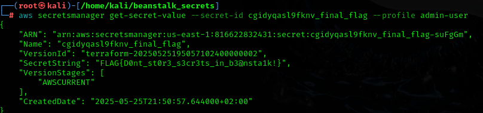
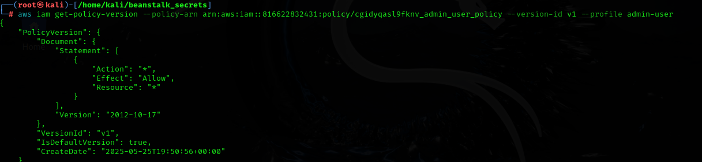
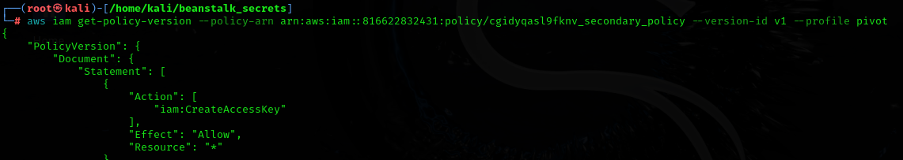

# 🐐 CloudGoat - `beanstalk_secrets` Scenario Write-up


## ✅ Scenario Completed: `beanstalk_secrets`
**Goal**: Escalate from a low-privileged IAM user to full admin and extract the final flag from Secrets Manager.

---

## 🧭 Attack Path

1. Start with a low-privileged IAM user.
2. Use `elasticbeanstalk:DescribeConfigurationSettings` to dump Beanstalk env variables.
3. Discover hardcoded AWS credentials.
4. Pivot to a new IAM user (`secondary_user`) with `iam:CreateAccessKey` privileges.
5. Create new access key for `admin_user`.
6. Use `admin_user` credentials to retrieve the final flag from AWS Secrets Manager.

---

## 📸 Screenshots

### 🔐 1. Retrieving the final flag from Secrets Manager


---

### 🛡️ 2. `admin_user` has full `"Action": "*"` privileges


---

### 🪜 3. `secondary_user` has `iam:CreateAccessKey` — used for privilege escalation


---

## 🎯 Final Flag
```
FLAG{D0nt_st0r3_s3cr3ts_in_b3@nsta1k!}
```

---

## 🧠 Takeaways

- Never store secrets in Elastic Beanstalk env variables.
- Restrict IAM access to sensitive API calls (like `CreateAccessKey`).
- Always enforce **least privilege** and monitor secret exposure.
- Use **Secrets Manager**, not plaintext env configs.

---

## 🙏 Credits

Big thanks to [Tyler Ramsbey](https://www.linkedin.com/in/tyler-ramsbey/) for designing this great scenario in the *Introduction to AWS Pentesting* course.  
Highly recommended for anyone interested in hands-on cloud exploitation.

---

## 🏷️ Tags
`#AWS` `#CloudSecurity` `#PrivilegeEscalation` `#CTF` `#CloudGoat` `#ElasticBeanstalk`
